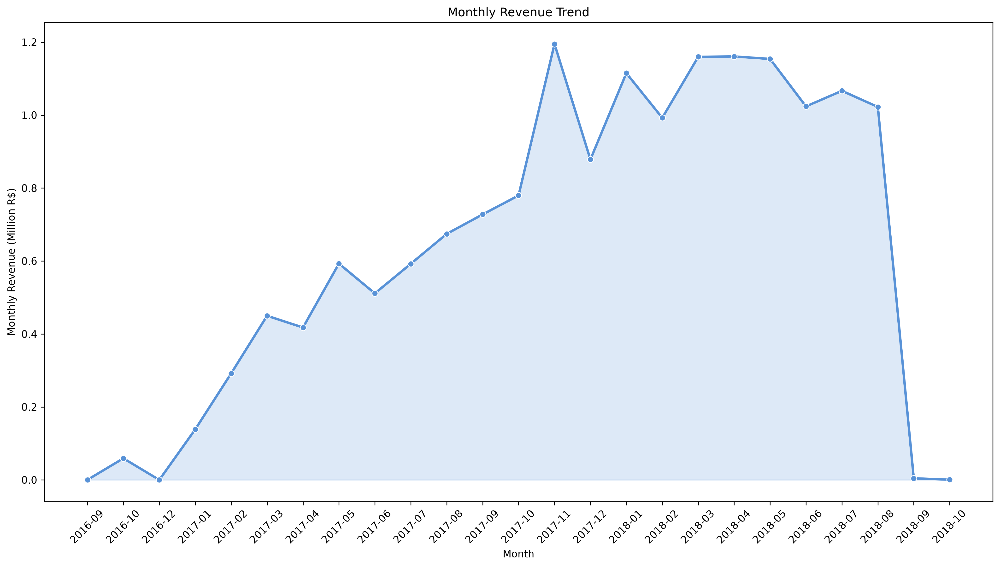
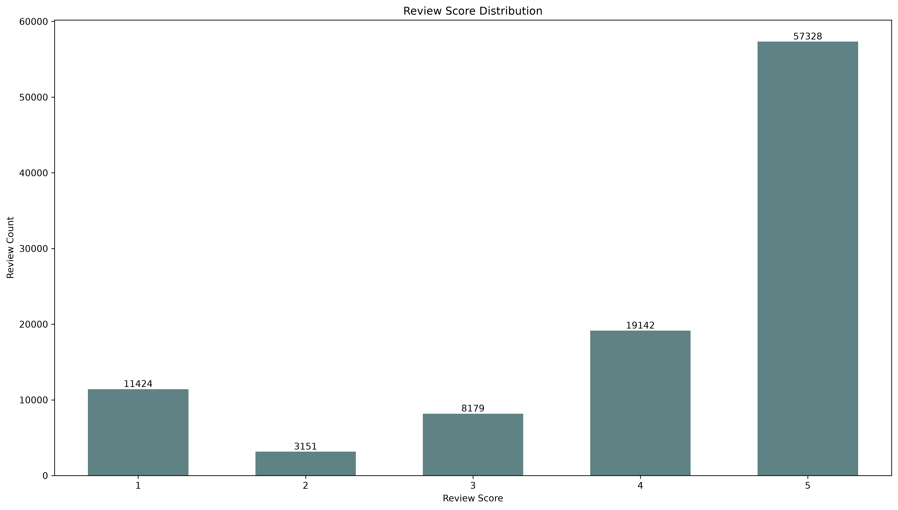
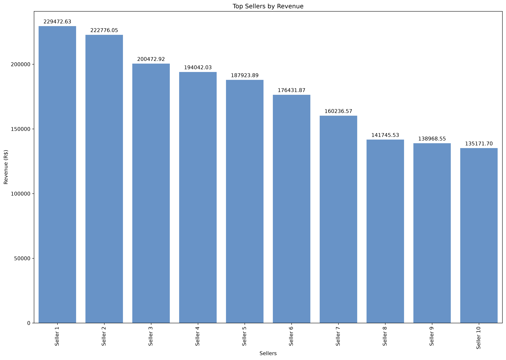

# 📦 Olist E-Commerce Analytics Engine

[](https://python.org)
[](https://www.mysql.com/)
[](https://pandas.pydata.org/)
[](LICENSE)

An end-to-end data pipeline and business intelligence suite analyzing over 100k Brazilian e-commerce orders. This project bridges normalized relational database design (MySQL) with statistical EDA and visual reporting (Python) to surface actionable insights across logistics, sales velocity, customer behavior, and merchant revenue.

---

## Executive Summary & Key Findings

* **Revenue Pareto Principle:** Merchant and category earnings follow a heavy power-law distribution—the top 10% of merchants account for the vast majority of gross merchandise value (GMV).
* **Fulfillment Bottlenecks:** While overall on-time delivery rates remain resilient, regional logistics across remote federative units show significant latency variance compared to central hubs (e.g., SP, RJ).
* **Customer Lifetime Dynamics:** Transaction frequencies indicate an overwhelming reliance on single-order acquisitions, underscoring retention and re-engagement as prime opportunities for growth.
* **Sentiment vs. Delivery Latency:** Review scores are inversely correlated with delivery delays; transit time degradation is the single largest driver of sub-3-star ratings.

---

## Architecture & Data Workflow
[Raw CSVs (Kaggle)]
│
▼
[MySQL Staging & Schema Design]  ──► Relational Modeling (PK/FK Constraints)
│
▼
[Complex SQL Analytical Layer]   ──► Window Functions, Aggregations, CTEs
│
▼ (SQLAlchemy / PyMySQL)
[Python EDA & Visualization]     ──► Pandas, Matplotlib, Seaborn
│
▼
[Executive KPI Reporting]        ──► Structured Visual Dashboard

---

## Core Analytics Modules

| Domain | Key Metrics & SQL Logic |
| :--- | :--- |
| **Financial KPIs** | Gross Revenue, Average Order Value (AOV), Monthly Recurring Run Rates |
| **Logistics & Ops** | Transit Delta (`order_delivered_customer_date` vs `order_estimated_delivery_date`), Delay Outliers, State Latency Rankings |
| **Customer Profiling** | Geographic density maps, spend distribution percentiles, repeat purchase cohorts |
| **Catalog & Sellers** | Margin-leading product categories, unit volume leaders, seller concentration ratios |
| **Feedback Diagnostics** | Rating distributions, Category-specific sentiment scoring, delivery delay impact curves |

---

## Visual Showcase

### Executive Summary Dashboard


### Performance Breakdowns
| Metric | Visualization |
| :--- | :--- |
| **Sales Velocity** |  |
| **Category Distribution** |  |
| **Rating Spread** |  |
| **Merchant Volume** |  |

---

## Repository Structure

```text
├── data/                      # Data dictionaries and schemas
├── images/                    # Exported visual artifacts & plots
├── notebooks/
│   ├── 01_import_mysql.ipynb  # Schema creation & high-throughput CSV ingestion
│   ├── 02_sql_analysis.ipynb  # CTEs, joins, and relational querying
│   ├── 03_python_eda.ipynb    # Statistical profiling and distribution checks
│   └── 04_dashboard.ipynb     # Multi-panel visualization assembly
├── sql/
│   ├── schema.sql             # Table declarations & indexes
│   ├── import_queries.sql     # Data loading scripts
│   └── analysis_queries.sql   # Production analytical queries
├── .env.example               # Template for environment credentials
├── requirements.txt           # Locked package dependencies
└── README.md

Quickstart
Prerequisites
Python 3.11+

MySQL Server 8.0+

Kaggle account / Brazilian E-Commerce dataset downloaded to data/

## Installation
Clone the repository:

Bash
git clone [https://github.com/](https://github.com/)<your-username>/olist-ecommerce-sql-python-analysis.git
cd olist-ecommerce-sql-python-analysis
Environment configuration:

Bash
cp .env.example .env
Populate .env with your database credentials:

Ini, TOML
MYSQL_USER=root
MYSQL_PASSWORD=your_secure_password
MYSQL_HOST=127.0.0.1
MYSQL_PORT=3306
MYSQL_DATABASE=olist
Install dependencies:

Bash
python -m venv venv
source venv/bin/activate  # On Windows: venv\Scripts\activate
pip install -r requirements.txt
Run pipeline:
Execute notebooks in numerical order (01 through 04) or run the raw SQL scripts located in sql/ directly via your preferred database client.
# 👨‍💻 Author
Suhana Kesharwani

Data & Software Engineering